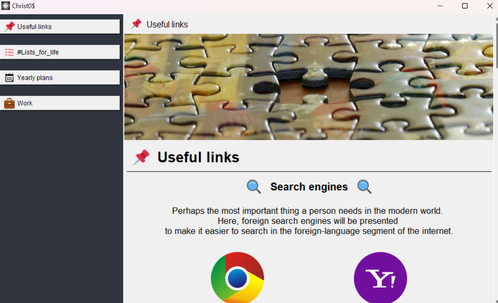

# Christ0$

Christ0$ is a Python application with a graphical user interface created using tkinter. 
The main window of the application contains a sidebar with tabs for various functions, including useful links, annual plans, lists, a blog, and work-related tasks.
Christ0$ is a planner program.

## Main Features

- **Main window** with a sidebar displaying tabs for different categories
- Support for dynamic content loading onto the central canvas for each tab
- Support for horizontal scrolling with the mouse for easier navigation
- Support for custom icons and images for tabs

## Project structure

```bash
├── assets
│   ├── main
│   ├── screenshots
│   ├── useful_links
│   ├── blog
│   │   └── ideas_and_plans 
│   ├── lists_for_life
│   │   ├── courses
│   │   ├── goals
│   │   ├── reading
│   │   └── wishlist
│   ├── work
│   ├── yearly_plans
│   │   └── year
├── data
│   ├── years
│   └── json files
├── config
│   ├── imports.py
│   ├── utils.py
│   ├── tooltip.py
│   └── settings.py
├── src
│   └── tabs python files
├── main.py
├── .gitignore
└── README.md
```

## Screenshots

Welcome window:


*Image 1. Welcome window*

Use buttons on left tabs to navigate through the program.

Main tabs:


*Image 2. Useful links tab*


*Image 3. #Lists_for_life tab*


*Image 4. Yearly plans tab*


*Image 5. Work tab*

## Installation

1. Clone the repository:
   ```bash
   git clone https://gitlab.com/ladystuart/planner.git
   cd planner
   
    # Navigate into the project directory
    cd repository-name
   
    # Install required packages
    pip install -r requirements.txt

2. Create setup file:
   ```bash
   pip install pyinstaller
   
   # Dist folder
   pyinstaller --onefile --windowed --icon=icon.ico \
   --add-data "assets;assets" \
   --add-data "src;src" \
   --add-data "data;data" main.py
   
   # Delete unwanted files
   # Copy assets, data and src folders to Dist
   # Use .iss file to configure the setupper
   
## Resources used

- [ChatGPT](https://chat.openai.com/)
- [Icons](https://icons8.com/icons)
- [Stack Overflow](https://stackoverflow.com/)
- [Notion](https://www.notion.so/)